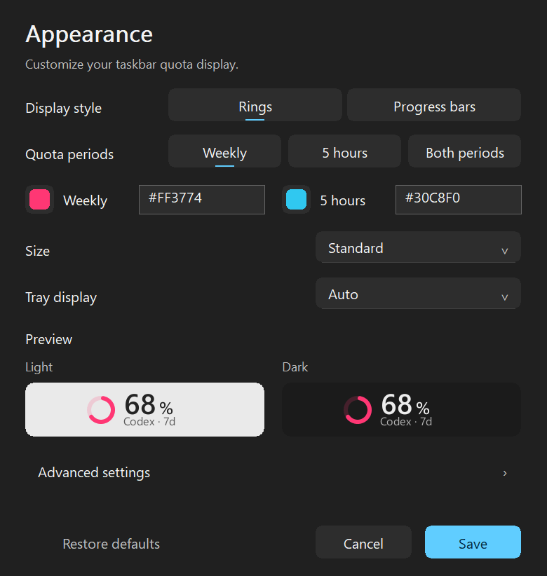

# QuotaBar

**Codex quota, at a glance.** A lightweight native Windows 11 taskbar tool with colorful rings or progress bars for weekly and 5-hour remaining quota.

[简体中文](README.zh-CN.md) · [Download](https://github.com/study-233/ailimits/releases/latest) · [Configuration](docs/en/CONFIG.md) · [Changelog](CHANGELOG.md)


*Samples from the actual renderer, using demonstration values. Left: light theme; right: dark theme. Each style shows weekly, 5-hour and both-period variants.*

## Small surface, useful choices

- **Rings or bars.** Dual rings use the outer ring for 5 hours and the inner ring for the week.
- **Weekly, 5-hour or both.** `5h` means 5 hours; `7d` means weekly. A single weekly ring is the default.
- **At home on the taskbar.** Theme-aware, DPI-aware, follows auto-hide and full-screen visibility; drag and lock its position.
- **Synchronized tray and panel.** Both follow the selected shape, periods and colors; the tray also offers compact numbers and status markers.
- **Native preferences.** Color, size and separate theme previews up front; positions, thickness and typography in a collapsible advanced section.
- **Lightweight architecture.** Rust, Win32 and CPU vector drawing. No WebView, bundled fonts or continuous animation. Both periods reuse existing quota requests.
- **English and Simplified Chinese**, with live Windows static-proxy support and a direct-connection option.

## Download

Choose Windows 11 x64 assets from [Releases](https://github.com/study-233/ailimits/releases/latest):

| Asset | Use |
| --- | --- |
| `QuotaBar-Setup-<version>.exe` | Per-user installation with automatic updates |
| `QuotaBar-Portable-<version>.zip` | Extract and run `ailimits.exe`; update manually |
| `SHA256SUMS.txt` | Verify with `Get-FileHash <file> -Algorithm SHA256` |

The v0.2.0 build uses QuotaBar asset names. Public availability follows the releases actually published. This distribution is not published to winget, Scoop, Chocolatey or Microsoft Store.

Install over v0.1.0 to update the Windows app name to **QuotaBar** and remove old shortcuts. Configuration, credentials, position and the installation identity remain compatible. The executable stays `ailimits.exe`; configuration stays in `%APPDATA%\AiLimits\config.toml`. Older `0.6.4` development builds require a first manual upgrade.

The bootstrap installer also verifies the download before installation:

```powershell
irm https://raw.githubusercontent.com/study-233/ailimits/master/install.ps1 | iex
```

## Get started

1. Sign in with the official Codex CLI, then launch `ailimits.exe`.
2. Right-click the taskbar panel → **Appearance settings…**. Choose a style and quota periods.
3. **Save** to keep the changes. Edits preview immediately; **Cancel** or closing restores the previous appearance.



Drag horizontally to position the panel; Esc cancels a drag. **Lock position** prevents movement. **Restore automatic position** finds free space again. A crowded taskbar never switches to tray automatically; choose the tray explicitly from the menu.

## Questions

**Used or remaining?** Always remaining: 100% fills the ring/bar; 0% leaves only the track.

**Does this display the Plus 5-hour window?** It displays the 5-hour window returned for your account without a hardcoded plan-name restriction. A missing window shows `—`; another period never substitutes for it.

**Pro hover tips?** Explicit `pro` and `prolite` accounts show weekly quota in hover tips. This does not alter the selected indicator graphics.

**Why grey or `≈`?** Missing, stale or estimated data is muted. Estimates carry `≈`. Hover for period, status and reset time in your local time zone. A reset timestamp passing alone does not confirm a fresh quota.

**Why did the installed name contain “fork”?** The old installer embedded that name. v0.2.0 uses the independent QuotaBar name; an in-place installation updates the displayed name.

**Does it modify CLI tokens?** Existing authentication is read without refreshing or rotating official CLI tokens. Manually entered secrets use Windows Credential Manager.

**Other providers?** Existing Claude, Copilot and Antigravity integrations remain available. The panel and tray presentation in this version focuses on Codex.

See [configuration and authentication](docs/en/CONFIG.md) for proxy rules and advanced options.

## Build

Use Windows, Rust's MSVC toolchain and Visual Studio C++ Build Tools with the Windows SDK.

```powershell
cargo +stable-x86_64-pc-windows-msvc fmt --all -- --check
cargo +stable-x86_64-pc-windows-msvc clippy --locked --all-targets -- -D warnings
cargo +stable-x86_64-pc-windows-msvc test --locked
cargo +stable-x86_64-pc-windows-msvc build --locked --profile release-min --bins
```

Binaries are written to `target/release-min/`. Package them with Inno Setup 6:

```powershell
./tools/package-release.ps1 -Version 0.2.0 -Iscc 'C:\path\to\ISCC.exe'
```

Network tests use local mock servers, without real tokens. See [validation](docs/en/VALIDATION.md) for rendering and native preferences checks. Release automation creates a draft for review; it does not replace an already-published release.

## Attribution and license

Based on [napxlexn/ailimits](https://github.com/napxlexn/ailimits), independently maintained by study-233. Original code Copyright (C) 2026 napxlexn; modifications by study-233.

Licensed under [GPL-3.0-or-later](LICENSE). Original attribution and the [upstream name/logo policy](TRADEMARKS.md) are preserved. QuotaBar uses its own name and original icon and is not an official upstream or OpenAI product.
