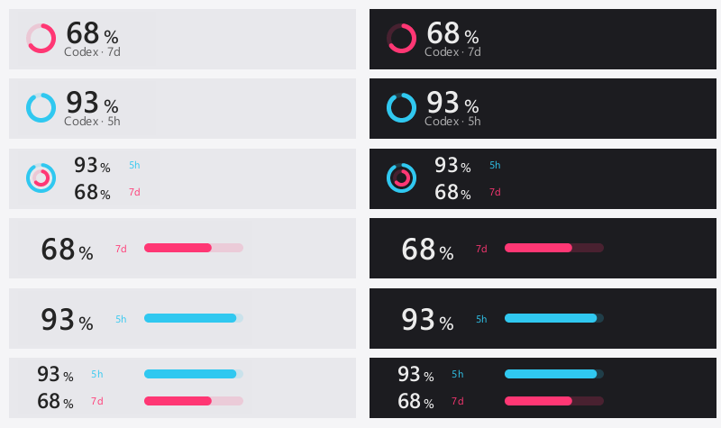

# QuotaBar

**Квота Codex на панелі завдань.** Нативний застосунок для Windows 11 x64, що показує залишок тижневої та 5-годинної квоти кільцями або смужками.

Це незалежна версія **study-233/ailimits**, заснована на AI Limits. Цей посібник описує QuotaBar v0.4.0; повна актуальна документація доступна [англійською](README.md) та [спрощеною китайською](README.zh-CN.md). Інтерфейс застосунку підтримує англійську та спрощену китайську.



*Зразки з реального рендерера; значення демонстраційні.*

## Завантаження

Відкрий [Releases цього репозиторію](https://github.com/study-233/ailimits/releases/latest):

- `QuotaBar-Setup-<версія>.exe` — встановлення для поточного користувача з автоматичними оновленнями.
- `QuotaBar-Portable-<версія>.zip` — розпакуй і запусти `ailimits.exe`; оновлюй вручну.
- `SHA256SUMS.txt` — контрольні суми для перевірки завантаження.

Доступність версій визначається фактично опублікованими релізами. **QuotaBar не опубліковано у winget, Scoop, Chocolatey або Microsoft Store.** Пакети оригінального AI Limits не є цією версією.

Скрипт завантажує та перевіряє інсталятор:

```powershell
irm https://raw.githubusercontent.com/study-233/ailimits/master/install.ps1 | iex
```

## Початок роботи

1. Увійди в обліковий запис через офіційний Codex CLI та запусти `ailimits.exe`.
2. Натисни правою кнопкою на панелі → **Appearance settings…**. Обери кільця або смужки та тижневу, 5-годинну або обидві квоти.
3. На сторінці **Panel content** налаштуй видимість і порядок модулів. **Save** зберігає зміни, **Cancel** скасовує попередній перегляд.

Лівий клік відкриває деталі: 5-годинну й тижневу квоти, можливості скидання, історію квот та активність Token. Повторний клік, клік поза панеллю або Esc закриває її. Числа означають **залишок**, а не використану частку; у подвійних кільцях зовнішнє показує 5 годин, внутрішнє — тиждень.

Історія містить 30 днів реальних локальних спостережень окремо для кожного облікового запису. Додаткові модулі за потреби читають дані через локальний офіційний Codex App Server, який сам керує своєю автентифікацією. QuotaBar не запускає вхід, вихід, розмови з моделлю та не витрачає можливості скидання.

Налаштування залишаються у `%APPDATA%\AiLimits\config.toml`. Встановлення поверх попередньої версії зберігає налаштування та облікові дані. Старі збірки розробки `0.6.4` потребують першого ручного оновлення.

## Походження та ліцензія

На основі [AI Limits від napxlexn](https://github.com/napxlexn/ailimits), незалежна підтримка — study-233. Оригінальний код Copyright (C) 2026 napxlexn; зміни — study-233.

Ліцензія [GPL-3.0-or-later](LICENSE). Збережено [правила використання назви й логотипа](TRADEMARKS.md). QuotaBar має власну назву та іконку і не є офіційним продуктом AI Limits або OpenAI.
