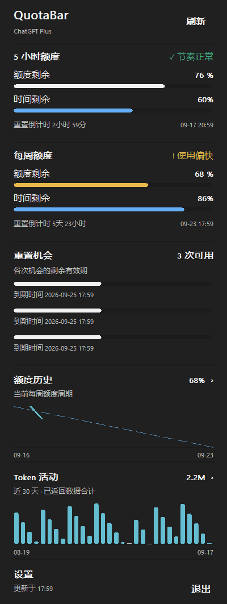
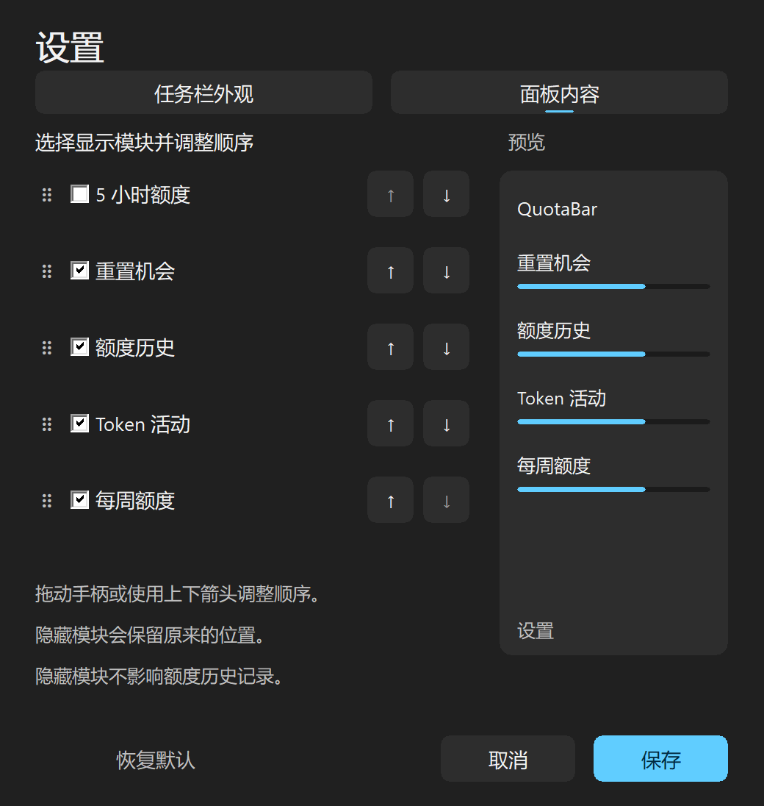

# QuotaBar

**把 Codex 余量放在任务栏上。** 轻量级 Windows 11 原生工具，用彩色圆环或横条查看每周与 5 小时剩余额度。

[English](README.md) · [下载](https://github.com/study-233/ailimits/releases/latest) · [配置说明](docs/en/CONFIG.md) · [更新记录](CHANGELOG.md)


*由实际绘制代码生成的示例：左侧浅色、右侧深色；依次为每周、5 小时和双周期的圆环／横条。数值为演示数据。*

## 简洁，也可自定义

- **圆环 / 横条**：一键切换；双圆环外圈为 5 小时，内圈为每周。
- **每周 / 5 小时 / 同时显示**：按需要选择。`5h` 表示 5 小时，`7d` 表示每周。默认只显示每周圆环。
- **跟随 Windows**：支持深浅任务栏、DPI 缩放、自动隐藏和全屏隐藏；可拖动、锁定位置。
- **托盘与任务栏同步**：共享样式、周期和颜色；托盘还可选择紧凑数字和状态标记。
- **点击查看详情**：左键打开完整配额面板，默认显示 5 小时、每周、重置机会、额度历史和 Token 活动。面板模块独立于任务栏，可分别开关和排序。再次点击、点击外部或按 Esc 关闭，不再显示悬停提示。
- **原生设置**：分为“任务栏外观”和“面板内容”。拖动手柄或使用上下按钮排列模块，实时预览，保存生效，取消回滚。隐藏模块保留位置，历史继续记录。
- **保持轻量**：Rust + Win32 + CPU 矢量绘制，无 WebView、无字体下载、无持续动画；复用现有额度请求。
- **中英文界面**：跟随系统或手动切换；支持 Windows 静态系统代理和直连。

## 下载与安装

从 [Releases](https://github.com/study-233/ailimits/releases/latest) 下载 Windows 11 x64 构建：

| 文件 | 用途 |
| --- | --- |
| `QuotaBar-Setup-<版本>.exe` | 推荐，当前用户安装，支持应用内自动更新 |
| `QuotaBar-Portable-<版本>.zip` | 解压后运行 `ailimits.exe`，后续手动更新 |
| `SHA256SUMS.txt` | 使用 `Get-FileHash <文件> -Algorithm SHA256` 校验 |

v0.2.0 的构建产物采用 QuotaBar 名称；公开下载以 Releases 中实际发布的版本为准。此仓库未发布到 winget、Scoop、Chocolatey 或 Microsoft Store。

从 v0.1.0 覆盖安装后，Windows 应用列表将显示 **QuotaBar**。原有配置、凭据和位置继续保留，旧名称快捷方式会清理。程序内部文件名仍为 `ailimits.exe`，配置仍在 `%APPDATA%\AiLimits\config.toml`。旧 `0.6.4` 开发版本需首次手动升级。

也可使用下载并验证安装器的脚本：

```powershell
irm https://raw.githubusercontent.com/study-233/ailimits/master/install.ps1 | iex
```

## 三步开始

1. 在官方 Codex CLI 中登录账号，然后启动 `ailimits.exe`。
2. 右键任务栏 → **外观设置…**，在“任务栏外观”选择样式；在“面板内容”选择显示模块并排序。
3. 点击**保存**。修改会实时预览，取消或关闭窗口会恢复之前的外观。



*原生绘制的演示数据。面板模块独立配置，长内容滚动；点击图表打开周期详情。*



拖动面板可调整水平位置；Esc 取消拖动。“锁定位置”禁止移动，“恢复自动位置”重新寻找空白区域。任务栏拥挤时不会自动切换为托盘，可从菜单手动选择托盘图标。

额度历史从本程序实际观测开始，按账号隔离保留最近 30 天；隐藏模块不会停止记录。Token 使用接口返回的每日数据，缺失日期不计为零。点击额度图可选当前周期、近 7 天、近 30 天；Token 图可选近 7 天、近 30 天，指向数据点查看日期和数值。

扩展模块仅在打开面板且缓存超过 5 分钟时读取；手动刷新同时更新基础额度与已启用的扩展模块。读取结束或 25 秒超时后退出辅助进程并清理其子进程。未安装 Codex、接口不支持或账号无法匹配时保留明确的不可用状态。重置机会仅供查看，不会消耗次数。

## 常见问题

**数字表示已用还是剩余？** 统一表示剩余。100% 为满环／满条，0% 只保留底轨。

**Plus 的 5 小时额度能显示吗？** 可以读取账号接口返回的 5 小时周期，不按套餐名称限制；没有该周期时显示 `—`，不会拿每周额度代替。

**Pro 的详情显示什么？** 所有套餐默认显示完整的五个模块，可在“面板内容”独立选择显示内容及顺序。任务栏和托盘不显示悬停提示。

**灰色或 `≈` 是什么？** 灰色表示缺失、过期或估算状态，`≈` 表示估算。左键点击查看周期、状态和本地重置时间。仅凭重置时间已过，不能确认额度已恢复。

**为什么旧版有 fork？** 旧安装器把它写进了应用名称。v0.2.0 改用独立名称 QuotaBar，覆盖安装即可更新显示名称。

**会修改 CLI 令牌吗？** 基础额度请求只读现有令牌。重置机会和每日 Token 按需调用本机官方 Codex App Server，由官方 CLI 管理自身认证；QuotaBar 不发起登录、登出或模型对话。手动设置的密钥仍存储在 Windows 凭据管理器。

**其他服务商呢？** 保留 Claude、Copilot、Antigravity 的现有接入能力；本轮任务栏和托盘的额度显示聚焦 Codex。

代理规则、认证命令和配置路径见[配置与网络](docs/zh-CN/CONFIG.md)。

## 从源码构建

需要 Windows、Rust MSVC 工具链、Visual Studio C++ Build Tools 和 Windows SDK。

```powershell
cargo +stable-x86_64-pc-windows-msvc fmt --all -- --check
cargo +stable-x86_64-pc-windows-msvc clippy --locked --all-targets -- -D warnings
cargo +stable-x86_64-pc-windows-msvc test --locked
cargo +stable-x86_64-pc-windows-msvc build --locked --profile release-min --bins
```

产物位于 `target/release-min/`。使用 Inno Setup 6 构建安装器：

```powershell
./tools/package-release.ps1 -Version 0.3.0 -Iscc 'C:\路径\ISCC.exe'
```

网络测试只使用本地模拟服务，不依赖真实令牌。渲染预览与原生设置验证说明见[开发验证](docs/en/VALIDATION.md)。

## 致谢与许可

基于 [napxlexn/ailimits](https://github.com/napxlexn/ailimits)，由 study-233 独立维护。原始代码 Copyright (C) 2026 napxlexn，修改部分由 study-233 维护。

遵循 [GPL-3.0-or-later](LICENSE)。保留上游署名和[名称及标志说明](TRADEMARKS.md)；QuotaBar 使用独立名称和原创图标，不代表上游或 OpenAI 官方产品。
