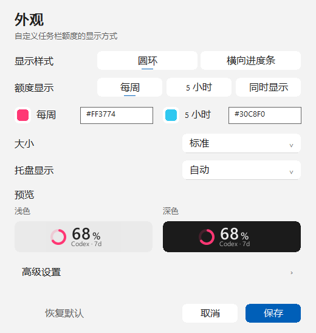
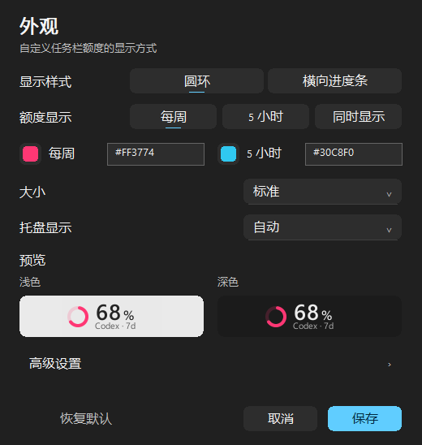

# QuotaBar UI 设计与实现记录

## 项目结构与改动范围

项目使用 Rust、tao 事件循环、Win32 原生窗口/控件、tiny-skia 与 fontdue CPU 绘制、muda 原生菜单和 tray-icon。任务栏由透明分层窗口叠加，并沿用原有定位、拖动、锁定、避让、自动隐藏和全屏抑制逻辑。外观窗口维护草稿，预览通过事件发送；保存提交，取消回滚。

这轮没有更换 UI 框架，没有新增第三方包。仅启用已有 windows crate 的 Shell API feature，用于原生控件 subclass。数据解析、OAuth/凭据、代理、轮询、通知、更新器和安装流程均保留。

## Design System

- `src/ui/theme.rs`：`SurfaceTheme` 集中定义背景、次级背景、表面、Hover、Pressed、边框、三级文字、统一蓝色 Accent、Warning、Danger。保留已有可配置 quota 配色和旧 palette。
- `UiMetrics`：标题 22 DIP、正文 13 DIP、说明 12 DIP、控件高 32 DIP、圆角 6/8/12 DIP、4/8/12/16/24/32 间距节奏。
- `src/ui/native_controls.rs`：共享文字绘制、圆角表面、GDI 色值与字体选择。GDI 先核验 Segoe UI Variable 的实际字体映射，无法选择时回退 Segoe UI；fontdue 也优先尝试可变字体，中文使用现有 Windows 字体回退。
- Native Button 的正常、悬停、按下、禁用、焦点和选中态采用共享 tokens。ComboBox 保留系统键盘与列表行为，重新绘制收起状态；Edit 保留编辑行为并增加内边距及主题边框。

## 任务栏和托盘

任务栏保留圆环 + 大数字 + 小百分号 + Codex/周期标签。标签改为中性次级文字，降低粉色文字的竞争；收紧百分号间距、默认水平偏移和末尾留白。标准数字配置的 20 DIP 是实际墨迹高度，对应约 28 DIP 的字体 em；保留用户的字号配置及 Semibold。

浮层加入轻微 Hover / Pressed 背景，不缩放、不增加空闲动画计时器。额度正常时数字中性；使用自动文字色时，低于已有 Codex 阈值逐步采用 Warning / Danger。用户明确指定的数字颜色保留。

托盘按系统图标尺寸直接生成，与任务栏共用显示样式、周期配色及周期选择；双周期保留两个圆环或进度条。“自动”和“图形 + 状态”增加低额度/不可用状态点，“数字”共用数字颜色与字重。两处悬浮信息共用摘要生成逻辑、周期行序、重置倒计时和更新时间；明确为 `pro` / `prolite` 时仅显示周额度。未知/缓存/估算状态不伪装为实时读数。

## 菜单和设置窗口

`native_menu.rs` 只改变原生 HMENU 的绘制，muda 继续负责动作与勾选分发，Windows 继续负责弹出、键盘导航和关闭。统一 32 DIP 行高、分组间隔、Hover、勾选、Submenu 箭头和较小的禁用版本信息。线程内 hook 仅匹配本应用登记的菜单，销毁时释放 brush 并取消 hook。对原生菜单追加的旧式箭头，仅重绘箭头所在区域。

外观窗口从 680 DIP 宽缩为 520 DIP，基础内容高 548 DIP。内容包括：说明、分段样式/周期选择、两个小色块及 Hex 输入、尺寸、托盘显示、浅/深预览和高级导航行。底部恢复默认为弱操作，取消为次要按钮，保存为主按钮。

全部高级参数保留：圆环/条宽度、厚度、图形偏移、数字字号/偏移、符号比例、字重、数字颜色。展开时按两列排布；工作区不足时沿用垂直滚动和焦点自动滚动。双主题预览使用生产渲染器，过宽的自定义布局等比缩小显示。

窗口使用已有 QuotaBar 资源图标和系统标题栏，保留原生拖动区与关闭按钮。设置和菜单跟随应用主题，任务栏和托盘跟随系统主题，支持 Windows 混合主题。

## 本轮修改的代码文件

- `Cargo.toml`
- `src/app.rs`
- `src/config/appearance.rs`
- `src/i18n.rs`
- `src/platform/mod.rs`、`src/platform/win.rs`
- `src/ui/theme.rs`、`fonts.rs`、`numbers.rs`
- `src/ui/taskbar_panel.rs`、`quota_view.rs`、`tray.rs`
- `src/ui/context_menu.rs`、`native_menu.rs`（新增）
- `src/ui/appearance_dialog.rs`、`native_controls.rs`（新增）、`mod.rs`
- 配置和验证文档，以及 `docs/images/fluent-*` 截图

工作区开始时已有其他修改（包括品牌、发布、安装和配置功能）；这里列出的是本轮涉及的文件，不把那些既有改动当成本轮成果。

## 验证与限制

生产渲染器覆盖全部六种样式/周期组合，以及 0/1/99/100%、未知、估算状态；四档缩放为 100/125/150/200%。托盘覆盖 16/20/24/32 像素、四种模式、双主题和自定义阈值。

原生窗口检查实际打开窗口，导出中英文 × 双主题 × 四档 DPI 的截图，检查控件宽度、Save/Cancel/Enter/Escape、非法输入拒绝、实时预览事件，以及重复关闭后的 GDI 资源回收。DPI 变更由 WM_DPICHANGED 注入，不等同于已在四种真实显示器缩放配置上逐一人工验收。菜单检查实际弹出中英文浅/深菜单并截图。输出位于 `target/quotabar-preview`。

没有强行引入 Mica/Acrylic：当前 GDI 子控件和不透明 CPU 画布无法稳定提供 WinUI 合成材质。标题栏、菜单外框及阴影由系统管理；实机验证表明原生 HMENU 会重置自定义窗口区域，无法稳定强制 WinUI 式圆角，因此保留系统外框。色选器与展开的 ComboBox 列表保留系统原生实现。交互采用即时、微弱状态反馈，没有引入缓动动画依赖。

后续值得继续验证：跨不同 DPI 的真实多屏移动、不同 Windows 11 shell 版本下的菜单/托盘、屏幕阅读器对 owner-drawn 选中态的播报、高对比度模式，以及非常宽的自定义预览布局。

## 预览

其他截图：[英文设置](../images/fluent-settings-en-dark.png)、[右键菜单](../images/fluent-menu-zh-dark.png)、[任务栏六种组合](../images/fluent-quota-styles.png)、[托盘原生尺寸样例](../images/fluent-tray-dark.png)。托盘样例按 16/20/24/32 像素分行，按 Auto/Ring/Number/RingState 分列，每组展示正常值 51 和低额度 07。

## 绘制回归修复与 Pro 悬浮信息（2026-09-17）

此前截图检查在捕获前强制重绘，且菜单检查未展开子菜单，不能证明真实交互正常。本次设置窗口改为短时借用并复制绘制状态，发布变更后才调用可重入的 Windows API；填充与布局期间抑制程序触发的编辑通知。按钮只响应点击通知，焦点变化不会意外提交。颜色选择器返回后重新读取当前状态，避免模态期间主题/DPI 变化留下失效资源。

ComboBox 使用固定高度 owner-draw 内容，关闭外观覆盖普通绘制、打印绘制及原生状态变更后的绘制。菜单不再在 WM_DRAWITEM 中替换系统弹出窗口过程；使用完成绘制后的线程通知补画箭头，并沿用整行高亮形状。注册失败恢复原生菜单，菜单背景画刷在使用期间保持有效。

Codex 响应中的 `plan_type` 随额度快照缓存。明确为 Pro 时，任务栏及托盘悬浮信息只显示周额度；选择 5 小时也不改变这条提示规则。未知套餐保留原有行为；缺失周额度显示不可用。图形、原始指标、告警和用户设置不变。缓存过期后的估算保留套餐信息，新的成功响应覆盖旧套餐信息。

原生设置的中英文、双主题、四档 DPI 消息检查及二级菜单检查已在修复过程中运行；截图不再预先强制重绘。完整菜单逐行验收在用户要求自行验收后停止，最终交互效果与真实跨屏行为交由用户验收。不要将旧截图或自动测试通过等同于最终人工验收。

最终非交互检查：124 项自动测试、格式检查、Clippy（警告视为错误）和 release 构建通过。验收程序为 `target/release/ailimits.exe`；未替换或重启正在运行的旧版 release-min 程序，需先退出旧版再打开新版。

## 托盘与任务栏同步修复（2026-09-17）

实际配置使用蓝色 `#0080FF`、周额度、图形 + 状态；旧托盘渲染器覆盖了周期颜色，且忽略了进度条及双周期选择。两处悬浮文案也由不同函数生成。现已共用图形和摘要规则，预览、保存、取消继续同时更新两处。当前缓存中的套餐标识是 `prolite`，已加入明确识别列表，并覆盖实时、缓存及周额度缺失的提示测试；不根据指标数量推断套餐。托盘的旧配置值保留，设置选项文案调整为实际行为。
